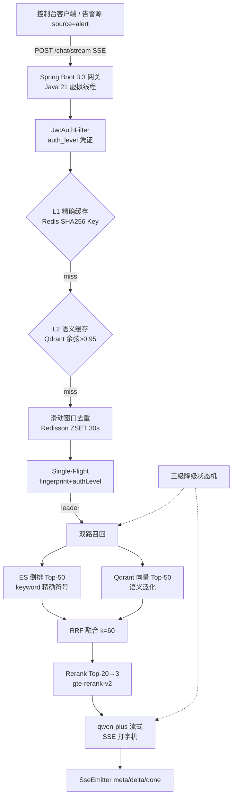
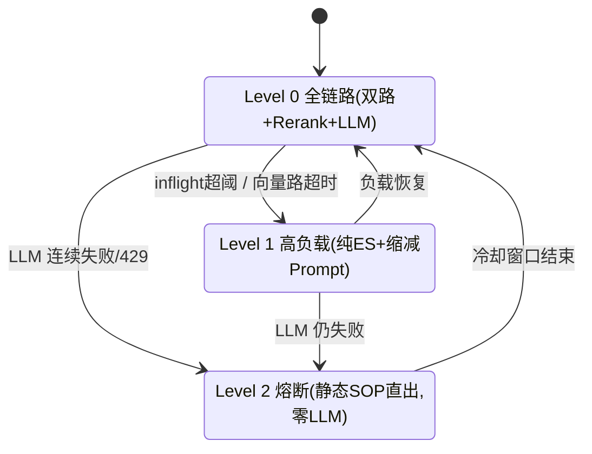

# OpsPilot — AIOps 智能排障与契约检索网关

> 基于 **Java 21 虚拟线程** 的混合 RAG（Hybrid Retrieval）排障网关：ES 倒排 + Qdrant 向量双路召回、RRF 融合、多级缓存、告警风暴指纹收敛与三级自适应降级。

## 核心指标（实测）

| 维度 | 目标 | 实测 | 口径 |
| --- | --- | --- | --- |
| 精确符号 Top-1 命中率 | 100% | **100%** | hybrid，25 错误码用例（live） |
| 语义 Top-3 召回率 | >90% | **100%** | hybrid，25 口语化用例（live） |
| 热点命中 TP99 | <50ms | **36.6ms** | 纯 L1 命中 n=500（live，回放不触外部 API） |
| 风暴 LLM 触发次数 | 500→1 | **1** | 500 并发同指纹，llm_calls Δ=1（live） |
| 权限泄漏率 | 0 | **0** | 5 条越狱用例，引擎层过滤（live） |
| 场景 A 吞吐 | — | **83 req/s · 0 失败 · P50=16ms** | Locust 50 并发 30s（live，冷请求走真实 API） |

> **Embedding 后端**：以上为 **DashScope live** 后端实测——`text-embedding-v3`（1024 维神经语义）+ `gte-rerank-v2`（精排）+ `qwen-plus`（流式生成）。无 `DASHSCOPE_API_KEY` 时服务自动切换本地词法 mock 后端，用于零成本机制验证与 CI 验收（同一代码路径，双模自动切换）。
>
> **live 独有的论证价值**：评测集显示语义查询的 **Top-1 命中率 `es_only` 仅 72% → hybrid 88%**（MRR 0.853→0.940）——向量路把纯词法在首位漏掉的 16% 口语化查询捞了回来。这是 mock 词法后端无法暴露、也只有接入神经向量后才成立的混合检索核心卖点。

## 架构



### 三级自适应降级状态机



## 技术栈

| 分层 | 选型 |
| --- | --- |
| 网关 | Java 21 + Spring Boot 3.3（Virtual Threads + SseEmitter） |
| 并发 | CompletableFuture + 虚拟线程执行器（双路并行、超时隔离） |
| 缓存/防线 | Redisson + Redis 7（滑动窗口、Single-Flight、L1） |
| 检索 | Elasticsearch 8（keyword 倒排）+ Qdrant（gRPC 向量） |
| 融合 | 自研 RRF（k=60）+ DashScope gte-rerank-v2 |
| 推理 | DashScope qwen-plus（OpenAI 兼容 SSE，JDK HttpClient 手写解析） |
| 离线 ETL | Python 3.11（OpenAPI AST 切分 + Markdown 标题树切分） |

## 快速开始

```bash
# 1. 环境变量（凭据只从环境读取，.env 不入库）
cp .env.example .env   # DASHSCOPE_API_KEY（留空走 mock）、JWT_SECRET、DEMO_PASSWORD、H2_DB_PASSWORD

# 2. 中间件
docker compose up -d   # Redis + Qdrant + ES（总内存 ≤2GB）

# 3. 离线切分 → chunks.jsonl
cd offline && python -m venv .venv && .venv/Scripts/pip install pytest
.venv/Scripts/python chunkers/build_chunks.py
.venv/Scripts/python -m pytest tests/

# 4. 红队畸形 token（验收用；合法账号不再预签，走 login）
python ../scripts/gen_tokens.py > ../scripts/redteam_tokens.txt

# 5. 入库 + 启动（项目根目录；用户主库 H2 文件自动建表）
java -jar target/opspilot-gateway-1.0.0.jar --opspilot.ingest=true

# 6. 初始化演示账号（幂等，读取 DEMO_PASSWORD）：sre-limited/sre-full/sre-acme
bash scripts/seed_demo_users.sh

# 7. 演示（客户端自动 login 换 24h token）
.venv/Scripts/python console_client.py "下单报 50012_DB_TIMEOUT 怎么排查"
.venv/Scripts/python console_client.py --storm --storm-n 500   # 告警风暴
```

## 评测与压测

```bash
cd offline
.venv/Scripts/python eval/build_golden.py     # 50 样本
.venv/Scripts/python eval/evaluate.py         # 3 模式对比 + 越狱 → eval/reports/
.venv/Scripts/locust -f load/locustfile.py --headless -u 50 -t 30s --html load/reports/locust_a.html
SCENARIO=storm .venv/Scripts/locust -f load/locustfile.py --headless -u 500 -t 15s --html load/reports/locust_b.html
```

## 安全设计

- **凭据零入库**：`DASHSCOPE_API_KEY`/`JWT_SECRET`/`DEMO_PASSWORD`/`H2_DB_PASSWORD` 仅从环境变量读取，`.env` 已 gitignore。
- **账号体系（P2）**：H2 文件主库 + bcrypt 口令 + 24h 短时 JWT；吊销实时——每请求校验账号存在性/disabled/token_ver，禁用或轮换版本即时全局失效旧 token（无黑名单膨胀）；登录失败 5 次/15min → 429；用户管理仅 CLI（口令只经 env/stdin，不进 argv），无 HTTP 用户端点。权限维度以 DB 为唯一真相，旧高等级 token 不残留权限。
- **租户隔离（P1）**：`tenant` 与 `auth_level` 同为 ES/Qdrant/L2/SOP 四面的引擎硬过滤维度（term 等值 + range lte 双 must），跨租户零命中且缓存永不跨租户回放；tenant claim 缺失/空白/超长在入口 401。
- **权限引擎层硬隔离**：`auth_level <= user_level` 注入 ES Query DSL 与 Qdrant Filter，Prompt 越狱无法跨越数据级过滤（实测 5 用例零泄漏）。检索密级恒等于 token 的 auth_level，**客户端不可通过参数覆盖**（QA 红队发现 `authLevelOverride` 提权面后已移除）。
- **运维端点鉴权**：`/api/v1/admin/**` 需有效 JWT，状态变更（降级/清缓存）额外要求 `auth_level>=3`，杜绝匿名强制降级 DoS。
- **缓存不成为泄漏通道**：L1 Key 掺 authLevel；L2 payload 携带 `max_auth_level` 并在检索时过滤；L2 命中回放携带完整 refs 保证溯源。
- **Single-Flight 按权限分组**：key=fingerprint+authLevel，防低权限等待者复用高权限答案。
- **指纹归一化抗噪**：掩码时间戳/UUID/traceId/msgId/引号串/数字（保留错误码身份），使真实告警变体（每条带唯一 ID）收敛到同一指纹——实测 10 条变体并发 → LLM 仅 1 次。
- **输入校验与错误卫生**：空/null query 在流开始前返回 400；全局异常处理器屏蔽 JVM 内部文案。
- **置信度空态门控**：检索 Top-1 相关度（Rerank 分数）低于 `min-relevance`（默认 0.2）或零召回时，显式拒答并**跳过 LLM 调用**（省算力、不误导）；精确符号快路径天然高置信，豁免门控。mock 后端用 IDF 词元覆盖率作相关度信号，live 模式自动切换为 `gte-rerank-v2` 校准分数。
- **SSRF 防护**：离线客户端/脚本仅允许 localhost 白名单（`localapi.py` 单一事实源）。
- **知识库零空窗重建（P4）**：blue/green 别名原子切流——staging 灌库 + 计数硬验收 + 单请求换 ES/Qdrant 别名，失败保留旧库在线（`POST /api/v1/admin/reingest`，ADR-0006）；实测在线把 mock 向量集零中断切到 live。
- **合规审计（P4）**：每请求一行 JSON 落 `logs/audit.jsonl`（谁/何租户/何密级/查了什么/命中来源/结果最高密级），14 天滚动。
- **成本护栏（P4）**：`/chat/stream` 每用户日配额（Redis INCR，默认 5000/天可 env 覆盖）——防失控循环；评测/检索路径不受限。
- **CI（P4）**：`mvn test`（零 key 零中间件）+ chunkers 不变量与**跨语言词法护栏**（Python 正则与 Java `EsSearchService.ERROR_CODE` 逐字符比对，防离线/在线漂移导致快路径静默 miss）。
- **哈希升级**：缓存 Key 由任务书原 MD5 升级为 SHA-256（安全扫描建议，语义不变）。
- **命名口径为刻意决策**：缓存存储 JSON 用 Jackson 默认 camelCase（`AnswerPayload`，从不上线），对外 SSE 帧用 snake_case（`SseEvents` 手工构 Map）——两域两制不做统一，理由与成本分析见 `AnswerPayload` Javadoc。

## QA 红队加固记录

首轮验收全绿后，经 Persona-QA-Simulator 黑盒红队发现并修复：
| 缺陷 | 等级 | 修复 |
| --- | --- | --- |
| search `authLevelOverride` 客户端提权 | P0 | 移除该参数，密级恒取 token |
| `/api/v1/admin/**` 零鉴权 | P0 | JWT + auth_level≥3 门禁 |
| 指纹归一化不足致真实风暴不收敛 | P1 | 强化噪声掩码管道 + 回归单测 |
| 缺 query 时 SSE 错误帧损坏 + NPE 泄露 | P1 | @Valid 前置校验 + 全局异常卫生 |
| degrade 非法枚举 500 | P2 | 白名单校验返回 400 |
| L2 命中丢 refs / 引用标号错位 | P2 | 缓存存完整 payload + 修正切块 |

## 面试 STAR 话术

- **S**：微服务告警风暴瞬时数千条同质告警打垮 LLM 链路；通用向量检索丢失错误码等精确符号，Top-1 不足 60%。
- **T**：7 天交付高并发混合检索排障网关，精确符号 Top-1 100%、热点 TP99<50ms、500 并发 LLM 降为 1 次、权限零泄漏。
- **A**：① Python AST 切分保护代码块/表格不腰斩，面包屑入元数据；② ES keyword + Qdrant 向量双路并行（虚拟线程+超时隔离），自研 RRF k=60 无量纲融合，精确符号快路径跳过 Rerank 压 TTFT；③ Redisson 滑动窗口 + 进程内 Single-Flight 收敛风暴；④ 三级降级状态机 LLM 429 熔断直出静态 SOP；⑤ auth_level 引擎层硬过滤 + 缓存权限维度。
- **R**：精确 Top-1 100%、语义 Hit@3 100%（hybrid 较纯 ES 把语义 Top-1 从 72% 拉到 88%）、热点 TP99 36.6ms、500 并发 LLM 仅 1 次、越狱零泄漏、场景 A 0 失败——均以 DashScope live 后端实测。

## 文档

- [DEMO.md](DEMO.md) — 六幕演示手册 + 预检脚本（`scripts/demo.sh`）
- [CONTEXT.md](CONTEXT.md) — 领域术语表
- [docs/adr/](docs/adr/) — 4 项架构决策记录
- [offline/eval/reports/](offline/eval/reports/) — 评测报告
- [offline/load/reports/](offline/load/reports/) — Locust 压测 HTML
