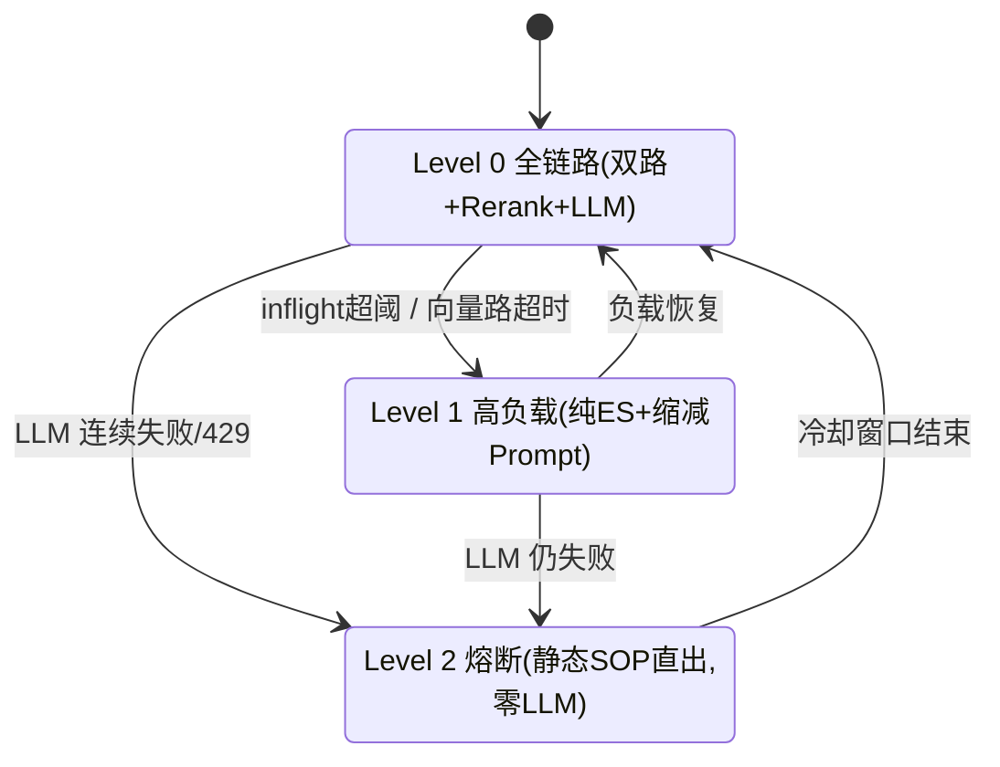

# OpsPilot — AIOps 智能排障与契约检索网关

> 基于 **Java 21 虚拟线程** 的混合 RAG（Hybrid Retrieval）排障网关：ES 倒排 + Qdrant 向量双路召回、RRF 融合、多级缓存、告警风暴指纹收敛与三级自适应降级。

## 它为什么存在（STAR）

- **S**：微服务告警风暴瞬时数千条同质告警打垮 LLM 链路；通用向量检索丢失错误码等精确符号，Top-1 不足 60%。
- **T**：7 天交付高并发混合检索排障网关：精确符号 Top-1 100%、热点 TP99<50ms、500 并发 LLM 降为 1 次、权限泄漏绝对 0；随后追加生产化硬化（租户隔离、账号体系、中间件加固、零空窗重建）。
- **A**：① Python AST 切分保护代码块/表格不腰斩，面包屑入元数据；② ES keyword + Qdrant 向量双路并行（虚拟线程+超时隔离），自研 RRF k=60 无量纲融合，精确符号快路径跳过 Rerank 压 TTFT；③ Redisson `来源×指纹` 聚合计数窗口 + 进程内 Single-Flight 收敛风暴（窗口供计数叙事，穿透闸门归 Single-Flight）；④ 三级降级状态机 LLM 429 熔断直出静态 SOP；⑤ auth_level + tenant 双维引擎层硬过滤，缓存/回放全链路权限维度；⑥ 五轮 QA 红队 + 双轴 code-review 闭环（P0 提权绕过 / TDD 锁；第四轮三 Persona 全系统测评揪出 Single-Flight 缺租户与 admin 信任域两处 P0；第五轮生成质量包立逐字导出出口硬护栏与熔断半开自愈）→ v1.0.0 冻结 → DashScope live 实测 → 四 Sprint 生产化（H2 账号+实时吊销、中间件凭据+环回、blue/green 原子切流、审计/配额/CI）→ 转公开前全模块独立+集成复验（台账 `docs/qa/2026-09-13-module-verification.md`），债务带触发线记录在案。
- **R**：精确 Top-1 100%、语义 Hit@3 100%（hybrid 较纯 ES 把语义 Top-1 从 64% 拉到 88%，2026-09-13 现报告版）、热点 TP99 36.6ms、500 并发 LLM 仅 1 次、越狱与跨租户零泄漏（双向判别语料 + 跨租户并发用例锁死）、场景 A 0 失败——均以 DashScope live 实测；生产化改造后 live 评测**逐位一致（零质量回退）**，蓝绿在线切流实测 27s 零中断（第四轮修复后 303 文档全量重灌 50s 零空窗）。

## AIOps 谱系定位 · 是什么，以及明确不是什么

> 回应一个专业读者必然会问的问题：**这算 AIOps，还是只是一个 RAG？** 按 Gartner 谱系五域自证，状态三分类——**已覆盖 / 待还债（触发线在案）/ 永久非目标（产品承诺）**，每条带可核验指针。此表同时渲染在 Ops Console 面板（能力边界旁），"知道自己不是什么"也是一等可观测面。

| AIOps 能力域 | 状态 | 事实与边界 | 证据指针 |
| --- | --- | --- | --- |
| ① 遥测采集（metrics/traces/topology） | **永久非目标** | 输入恒为一段文本 query（人贴堆栈或告警系统 POST），无指标流/事件总线/拓扑图；做成采集平台是另一个产品，不是本系统的缺口 | 「架构」节图入口面（三入口皆文本协议）；`gateway/CopilotController.java`、`gateway/OpenAiController.java`（全部入参=文本+元数据） |
| ② 异常检测（统计/ML） | **永久非目标** | 全仓无检测算法路径——"何时算异常"的判定权恒归上游告警系统，本系统消费其结果 | `grep -riE "anomal|forecast" src/main` 为空；CONTEXT.md 术语表无此词条（有词条必先入术语表，反向可验） |
| ③ 告警降噪 / 事件收敛 | **已覆盖（同指纹域）**，边界明示 | `来源×指纹` 滑窗计数 + 进程内 Single-Flight：500 并发同指纹 → LLM 仅 1 次。**跨指纹 incident 关联未覆盖且未在账**（前置=真实告警流接入，即 M3 挂起项），不冒充能力 | `storm/FingerprintService.java`、`storm/SingleFlightRegistry.java`；[ADR-0003](docs/adr/0003-single-instance-inprocess-single-flight.md)；A2-5（`offline/acceptance_a2.py`）；验证台账 `docs/qa/2026-09-13-module-verification.md` §3.2 |
| ④ 知识化根因辅助 | **已覆盖** | 双路召回 + RRF + 精排 over 46 篇复盘/Runbook + OpenAPI；置信度不足显式拒答而非硬编 | `retrieval/HybridSearchService.java`；[ADR-0001](docs/adr/0001-java-online-python-offline-split-at-jsonl.md)/[ADR-0002](docs/adr/0002-dashscope-one-stop-1024-dim.md)；`offline/eval/reports/eval_report.md`（es_only 64%→hybrid 88%，现报告版） |
| ⑤ 处置闭环（动作执行/自愈） | **待还债（触发线在案）** | 当前形态=输出可溯源排障步骤供**人**执行；对目标系统零写操作是产品承诺非缺陷。触发线：接入可审计执行通道（runbook 执行引擎 + 审批链/HITL 门）后立项；告警接入侧 M3 按硬约束挂起（无真实告警源不做 adapter） | OPS §5 债务闹钟表"处置闭环"行；`docs/ops/production-readiness-2026-09-12.md` M3 |

**一句话口径**：OpsPilot 做的是 AIOps 的 **③④ 两个子域的网关入口层**——"让告警风暴里的一条 query 得到可信、可溯源、越不了权的排障建议"。标题词 AIOps 指的是这个可验证子集；①②⑤ 上表三分类各归其位，欢迎按证据列逐行核验。

## 与朴素 RAG 的五条差异

> 骨架诚实承认：检索+生成就是 RAG。差异在骨架外那一圈**决定运维工程师敢不敢信**的东西——每条 = 机制 + 代码 + 验收锁，不是形容词：

1. **不知道就说不该知道**：检索 Top-1 相关度低于阈值或零召回 → 显式拒答并**跳过 LLM 调用**（朴素 RAG 会把空上下文硬喂给模型赌它不编）；精确符号快路径天然高置信豁免门控。→ `gateway/ChatOrchestrator.java` 门控分支、`config/OpsPilotProperties.java`（min-relevance）、QA 台账 P2-6（慢拒答归因）。
2. **权限是数据层不变量，不是提示词约定**：tenant/auth_level 以 term/range 注入 ES Query DSL 与 Qdrant Filter 双引擎，Prompt 越狱语料实测零泄漏——防线里没有任何"请不要回答越权内容"式的软承诺。→ `retrieval/EsSearchService.java`、`retrieval/QdrantSearchService.java`、[ADR-0008](docs/adr/0008-permission-dimensions-on-every-shared-path.md)、A2-8/8b/8c 边界矩阵。
3. **"可读"不等于"可倒出"**：出口句级 LCS 硬护栏（连续重叠 >80 字整句替换占位，carry=160 堵"逐行不超阈、拼接超阈"的表格式漏检），且设卡一处即同时覆盖生成流、缓存回放、Single-Flight follower 与双协议面。→ `llm/VerbatimStreamFilter.java`、`llm/VerbatimGuard.java`、[ADR-0010](docs/adr/0010-generation-layer-enforcement-split.md)、探针 V2/V3（`offline/qa_gen_quality_probes.py`）。
4. **溯源是合同不是装饰**：答案 refs 进 L1/L2 缓存 payload、随 Single-Flight 回放、落 SSE done 帧——引用标号在缓存命中路径与现网生成路径逐字节一致（第四轮 QA 曾把"L2 命中丢 refs"按缺陷修复并入回归锁）。→ `cache/L2SemanticCacheService.java`、A2-3/A2-9 引用断言。
5. **风暴与故障是设计输入，不是运行时异常**：同指纹 500 并发→1 次 LLM 穿透；过载降纯 ES、LLM 熔断直出预热静态 SOP、冷却到期半开自探（修复见 `e966feb`）——降级是状态机的一等公民，不是 catch 块。→ `storm/SingleFlightRegistry.java`、`resilience/DegradationStateMachine.java`、A2-5/A2-6、`DegradationRecoveryTest`。

> 五条合起来是一次**成功标准的换位**：朴素 RAG 的成败判据在检索指标；本系统的判据在"每个出口都可信"。这也解释了测试面为何比检索评测宽得多——118 单测 + A2 十项 + 探针 V1–V8 + 越狱/风暴/降级/留痕矩阵。

## 核心指标（实测）

| 维度 | 目标 | 实测 | 口径 |
| --- | --- | --- | --- |
| 精确符号 Top-1 命中率 | 100% | **100%** | hybrid，25 错误码用例（live） |
| 语义 Top-3 召回率 | >90% | **100%** | hybrid，25 口语化用例（live） |
| 热点命中 TP99 | <50ms | **36.6ms** | 纯 L1 命中 n=500（live，回放不触外部 API） |
| 风暴 LLM 触发次数 | 500→1 | **1** | 500 并发同指纹，llm_calls Δ=1（live） |
| 权限泄漏率 | 0 | **0** | 5 条越狱用例，引擎层过滤（live） |
| 场景 A 吞吐 | — | **88.4 req/s · 2492 请求 0 失败 · P50=16ms** | Locust 50 并发 30s（live，冷请求走真实 API；与随附 `locust_a_stats.csv` 一致） |

> **Embedding 后端**：以上为 **DashScope live** 后端实测——`text-embedding-v3`（1024 维神经语义）+ `gte-rerank-v2`（精排）+ `qwen-plus`（流式生成）。无 `DASHSCOPE_API_KEY` 时服务自动切换本地词法 mock 后端，用于零成本机制验证与 CI 验收（同一代码路径，双模自动切换）。
>
> **live 独有的论证价值**：评测集显示语义查询的 **Top-1 命中率 `es_only` 仅 64% → hybrid 88%**（MRR 0.813→0.940，2026-09-13 现报告版；语料扩至 303 篇前为 72%→88%）——向量路把纯词法在首位漏掉的 24 个百分点口语化查询捞了回来。这是 mock 词法后端无法暴露、也只有接入神经向量后才成立的混合检索核心卖点。

## 架构（30 秒看懂数据流）

三个入口共享同一条编排链路——这正是"两个协议面 + 一个面板"能保持语义一致的原因：

```mermaid
flowchart TD
    subgraph ENTRY[三个入口 · 同一编排]
        SSE[Console 客户端<br/>POST /api/v1/copilot/chat/stream · SSE]
        OAI[任意 OpenAI 客户端<br/>POST /v1/chat/completions · chunk]
        PANEL[Ops Console 面板<br/>只读 · /admin/state + audit 流]
    end
    SSE -->|JWT| AUTH
    OAI -->|JWT 即 API Key| AUTH
    AUTH[JwtAuthFilter · DB 单真相<br/>每请求查 H2：存在性/禁用/token_ver 吊销<br/>注入 tenant × auth_level × role]
    PANEL -->|platform 门禁 role=platform| ADM[AdminController<br/>聚合快照 + 审计事件环]
    AUTH --> OC[ChatOrchestrator · 唯一编排]
    OC --> QT[配额 5000/天/sub]
    QT --> FP[指纹归一化 SHA-256<br/>掩时间戳/UUID · 保留错误码]
    FP --> SF{Single-Flight<br/>组键 tenant+fp+authLevel<br/>ADR-0008 权限三元组}
    SF -->|follower| RP[回放 leader 答案<br/>载荷 src_tenant 绊线 fail-closed]
    SF -->|leader| HY[混合检索 双路并行 虚拟线程+超时隔离]
    HY --> ES[ES keyword Top-50<br/>tenant term + level range 硬过滤]
    HY --> QD[Qdrant 向量 Top-50<br/>must tenant + level lte]
    ES --> RR[RRF k=60 无量纲融合]
    QD --> RR
    RR --> RK[Rerank gte-rerank-v2<br/>精确符号快路径跳过]
    RK --> GT{置信度门控<br/>Top-1 < 0.2 或零召回}
    GT -->|拒答| NO[显式拒答 · 跳过 LLM]
    GT -->|通过| LLM[qwen-plus 流式生成]
    LLM --> WB[写回 L1/L2 缓存<br/>key/payload 全带租户]
    DG[三级降级状态机<br/>L0/L1/L2 见下图] -.->|L1 纯 ES / L2 熔断 SOP 直出| HY
    DG -.-> LLM
    RP --> OUT[Sink 投递：SSE meta/delta/done<br/>或 OpenAI chunk+[DONE]]
    NO --> OUT
    WB --> OUT
    OUT --> AUD[审计 logs/audit.jsonl<br/>谁/何租户/何密级/命中来源<br/>拒绝路径同样留痕]
```

- **权限是引擎层硬过滤不是 Prompt 约束**：tenant 与 auth_level 以 term/range 注入 ES Query DSL 与 Qdrant Filter，越权话术无法跨越数据级过滤；role 只在平台管理面生效（ADR-0008：权限三元组必须同构存在于每一条共享路径）。
- **知识库零空窗重建**：`POST /admin/reingest` 走 blue/green 别名原子切流（ADR-0006），失败保留旧库在线，实测 303 文档 50s 零中断。

### 三级自适应降级状态机



## 技术栈

| 分层 | 选型 |
| --- | --- |
| 网关 | Java 21 + Spring Boot 3.3（Virtual Threads + SseEmitter） |
| 并发 | CompletableFuture + 虚拟线程执行器（双路并行、超时隔离） |
| 缓存/防线 | Redisson + Redis 7（滑动窗口计数、L1 精确缓存、SOP 预热、配额 INCR） |
| 风暴收敛 | 进程内 Single-Flight（JDK `ConcurrentHashMap`+`CompletableFuture`，无外部依赖；ADR-0003） |
| 检索 | Elasticsearch 8（keyword 倒排）+ Qdrant（gRPC 向量） |
| 融合 | 自研 RRF（k=60）+ DashScope gte-rerank-v2 |
| 推理 | DashScope qwen-plus（OpenAI 兼容 SSE，JDK HttpClient 手写解析） |
| 离线 ETL | Python 3.11（OpenAPI AST 切分 + Markdown 标题树切分） |

## 快速开始（三条命令，零 key 零成本）

```bash
git clone https://github.com/shing26/opspilot-aiops && cd opspilot-aiops
bash scripts/quickstart.sh   # 生成随机凭据 .env（key 留空=mock）→ Docker 全栈（含网关镜像）→ seed 演示账号
bash scripts/demo.sh         # 预检全 PASS = 机制全链路就绪；打开 http://localhost:8081/ 即 Ops Console 面板
```

可选·机制级验收（对活体栈实跑，非单测）：`(set -a && . ./.env && set +a && cd offline && python3 acceptance_a2.py)`（10 项：L1/L2 缓存、500 并发风暴收敛、跨租户矩阵、拒绝留痕）与 `acceptance_a3.py`（8 项综合）。

> **口径必读**：`DASHSCOPE_API_KEY` 留空时服务自动切换 **mock 词法后端**（同一代码路径，零外部调用、零 Token 成本）——三条命令复现的是**机制正确性**；本页「核心指标」表为 **DashScope live 实测**口径，需自备 key 填入 `.env` 后重跑 `quickstart.sh` 复现，mock 环境不承诺该表数字。

前置：Docker（含 compose v2 + buildx 插件，quickstart 会预检并给出安装指引；即 `docker compose`/`docker buildx` 两条命令可用）、Linux/macOS 或 Windows+Git Bash；python3 可选（红队 token 生成与可选验收脚本用，缺失时 quickstart 会提示跳过）。内存预算：全栈 ≤2.4GB。

<details>
<summary><b>开发者路径</b>（宿主裸进程跑网关，需 JDK21 + Maven；与容器模式二选一，都占 8081）</summary>

```bash
# 1. 环境变量（凭据只从环境读取，.env 不入库）
cp .env.example .env   # DASHSCOPE_API_KEY（留空走 mock）、JWT_SECRET、DEMO_PASSWORD、H2_DB_PASSWORD

# 2. 中间件
docker compose up -d   # Redis + Qdrant + ES（总内存 ≤2GB）

# 3. 离线切分 → chunks.jsonl（Windows venv 为 Scripts/，Linux/macOS 为 bin/）
cd offline && python3 -m venv .venv && .venv/bin/pip install pytest
.venv/bin/python chunkers/build_chunks.py
.venv/bin/python -m pytest tests/

# 4. 红队畸形 token（验收用；合法账号不预签 token，走 login）
python ../scripts/gen_tokens.py > ../scripts/redteam_tokens.txt

# 5. 构建 + 启动（首启若读别名缺失会自动入库）
mvn package -DskipTests && java -jar target/opspilot-gateway-1.0.0.jar

# 6. 初始化演示账号（幂等，读取 DEMO_PASSWORD）：sre-limited/sre-full/sre-acme
bash scripts/seed_demo_users.sh

# 7. 演示（客户端自动 login 换 24h token）
.venv/bin/python console_client.py "下单报 50012_DB_TIMEOUT 怎么排查"
.venv/bin/python console_client.py --storm --storm-n 500   # 告警风暴
```

</details>

## Ops Console 运维面板（只读可观测面）

浏览器开 **`http://localhost:8081/`** 即得（同源静态单页，零构建/零 CDN/离线可开；ADR-0009）。把已存在的 metrics/health/audit 真相渲染成四块——**运行状态**（build 指纹 + 三依赖灯 + live/mock + 降级交通灯与熔断倒计时）、**数据流**（真计数墙 + Single-Flight 在途组 + 审计事件游标流）、**能力边界**（每条"不做的事"带依据与最后验证日期）、**AIOps 谱系定位**（本文档上方五域表的静态同源版，状态三分类+证据指针，把"不是完整 AIOps 平台"写在展示面上）。接入需 role=platform 的 JWT（=login token，即密钥），取法见 OPS §9。

设计口径与 LobeChat 撤壳（ADR-0007）互为注脚：**UI 壳证明兼容性，面板承载运维真相**——本页零写操作、零模拟动画（速率=前端对真实累计值求差）、成功读路径不落审计（实测轮询 60s audit 行增量 0）；事件游标用全局 seq 且轮转/重启以 `truncated` 显式告警，禁静默空洞。键名契约由 `scripts/check_panel_contract.sh` 在 CI 双向钉死（后端改名不同步面板即红）。演示用法见 DEMO 幕④⑥口播。

## OpenAI 兼容面（/v1）

网关自带 OpenAI 规范端点，任何标准客户端（LobeChat / Dify / OpenAI SDK）可直连：

```bash
# 身份即密钥：API Key = 用户自己 login 换来的 24h JWT（租户/密级/吊销/配额/审计全穿透）
set -a && . ./.env && set +a   # 口令只从 .env 的 DEMO_PASSWORD 来
TOKEN=$(curl -s -X POST http://localhost:8081/api/v1/auth/login \
  -H 'Content-Type: application/json' -d "{\"username\":\"sre-full\",\"password\":\"$DEMO_PASSWORD\"}" \
  | sed -E 's/.*"token":"([^"]+)".*/\1/')

curl -N http://localhost:8081/v1/chat/completions -H "Authorization: Bearer $TOKEN" \
  -H 'Content-Type: application/json' \
  -d '{"model":"opspilot","stream":true,"messages":[{"role":"user","content":"how to fix 50012_DB_TIMEOUT"}]}'
# → role 首帧 → content 增量帧 → 「## 参考来源」溯源注入 → finish_reason=stop → data:[DONE]
```

**接入方式**：上面 curl 即最小可用闭环；任何 OpenAI 标准客户端（LobeChat / Dify / SDK）填 Base URL `http://localhost:8081/v1` + API Key=上面的 TOKEN 即可直连。本仓库不捆绑 UI 前端——2026-09-11 曾以 LobeChat 壳实测全链路穿透（见 ADR-0007 状态注），后评估聊天壳对"运维系统可视化"零增益而撤除；协议面保留为展品本体，演示主形态为 curl 直播（DEMO 幕⑦）。

**协议取舍声明**（详见 ADR-0007）：无状态单轮——取最后一条 user 消息，忽略 system/历史（检索按单 query 指纹设计，多轮请由客户端并入单条消息）；自定义 meta/ttft 在 OpenAI 帧无位置，丢弃；溯源以正文尾部 markdown 保留。注意 Windows Git Bash 的 `curl -d` 发中文有 GBK locale 坑，测试请含 ASCII 或用脚本。

## 评测与压测

```bash
cd offline
PY=.venv/bin/python          # Windows venv 为 .venv/Scripts/python.exe；或直接 bash ../scripts/py.sh 探测
$PY eval/build_golden.py     # 50 样本
$PY eval/evaluate.py         # 3 模式对比 + 越狱 → eval/reports/（报告自报服务端 live/mock 后端真相）
.venv/bin/locust -f load/locustfile.py --headless -u 50 -t 30s --html load/reports/locust_a.html
SCENARIO=storm .venv/bin/locust -f load/locustfile.py --headless -u 500 -t 15s --html load/reports/locust_b.html
```

> 需活体栈 + `pip install locust`；`evaluate` 依赖的 `/copilot/search` 不受配额限制。数字底稿与指标出处即 `offline/eval/reports/eval_report.md`。

## 安全设计

- **凭据零入库**：`DASHSCOPE_API_KEY`/`JWT_SECRET`/`DEMO_PASSWORD`/`H2_DB_PASSWORD` 仅从环境变量读取，`.env` 已 gitignore。
- **账号体系（P2）**：H2 文件主库 + bcrypt 口令 + 24h 短时 JWT；吊销实时——每请求校验账号存在性/disabled/token_ver，禁用或轮换版本即时全局失效旧 token（无黑名单膨胀）；登录失败 5 次/15min → 429；用户管理仅 CLI（口令只经 env/stdin，不进 argv），无 HTTP 用户端点。权限维度以 DB 为唯一真相，旧高等级 token 不残留权限。
- **租户隔离（P1）**：`tenant` 与 `auth_level` 同为 ES/Qdrant/L2/SOP 四面的引擎硬过滤维度（term 等值 + range lte 双 must）；tenant claim 缺失/空白/超长在入口 401。**每一条跨请求共享路径同构携带全部权限维度**（ADR-0008）：L1 key 掺租户、L2 payload 带租户、SOP key 分租户、Single-Flight 组键掺租户且回放带 `src_tenant` 绊线——第四轮 QA 曾证实并修复"引擎过滤完备但并发共享旁路漏掺"的 P0 类缺陷（回归锁 `ChatOrchestratorTest` + A2-9 跨租户并发用例 + acme 自有语料双向判别）。
- **权限引擎层硬隔离**：`auth_level <= user_level` 注入 ES Query DSL 与 Qdrant Filter，Prompt 越狱无法跨越数据级过滤（实测 5 用例零泄漏）。检索密级恒等于 token 的 auth_level，**客户端不可通过参数覆盖**（QA 红队发现 `authLevelOverride` 提权面后已移除）。
- **运维端点鉴权**：`/api/v1/admin/**` **全部要求平台管理员**（DB `role=="platform"` ∧ `auth_level>=3`）——密级≠信任域，任何单一租户的高密级用户不得重建共享索引/清全局缓存/读运营指标（第四轮 QA 修正旧"level≥3 即管理员"口径；回归锁 AdminControllerTest 18 格矩阵）。
- **缓存不成为泄漏通道**：L1 Key 掺 authLevel；L2 payload 携带 `max_auth_level` 并在检索时过滤；L2 命中回放携带完整 refs 保证溯源。
- **Single-Flight 按权限分组**：key=**tenant**+fingerprint+authLevel，防低权限等待者复用高权限答案、更防跨租户共享（第四轮 QA 修复：key 曾缺 tenant，告警风暴并发下外来租户可回放内部租户全文——恰好是最引以为傲的场景；回放入口另有 fail-closed 租户绊线）。
- **指纹归一化抗噪**：掩码时间戳/UUID/traceId/msgId/引号串/数字（保留错误码身份），使真实告警变体（每条带唯一 ID）收敛到同一指纹——实测 10 条变体并发 → LLM 仅 1 次。
- **输入校验与错误卫生**：空/null query 在流开始前返回 400 **且错误文案必达客户端**（SSE 端点的 produces 会吞掉常规 advice 响应体——第四轮 QA 修复为直写 JSON）；客户端错误全面分层不落 500——参数类型/方法/媒体类型/未知路径（第五轮）与**请求体反序列化、Accept 协商**（转公开前复验补口，OpenAI SDK 非流式默认头即触发过 500）各有专属分支，400 类同步留 `ev=invalid` 审计，活体攻击参数面矩阵 13 用例 0×5xx；备份路径白名单拒绝呈现 400 可操作文案而非 500；`/v1` 面错误恒保持 OpenAI 标准 error 形状（filter 短路经直写、mapping 期异常由全局处理器按 URI 分流）；全局异常处理器屏蔽 JVM 内部文案。
- **置信度空态门控**：检索 Top-1 相关度（Rerank 分数）低于 `min-relevance`（默认 0.2）或零召回时，显式拒答并**跳过 LLM 调用**（省算力、不误导）；精确符号快路径天然高置信，豁免门控。mock 后端用 IDF 词元覆盖率作相关度信号，live 模式自动切换为 `gte-rerank-v2` 校准分数。
- **SSRF 防护**：离线客户端/脚本仅允许 localhost 白名单（`localapi.py` 单一事实源）。
- **知识库零空窗重建（P4）**：blue/green 别名原子切流——staging 灌库 + 计数硬验收 + 单请求换 ES/Qdrant 别名，失败保留旧库在线（`POST /api/v1/admin/reingest`，ADR-0006）；实测在线把 mock 向量集零中断切到 live。
- **合规审计**：业务请求每请求一行 JSON 落 `logs/audit.jsonl`（谁/何租户/何密级/查了什么/结果最高密级；回放路径另携带 `src_tenant` 命中来源）；鉴权拒绝/登录失败/运维动作同样留痕（`ev=auth|admin|invalid`，原因可辨）——"攻击探测事后不可查"曾是第四轮 QA 立案的 P1，现已补全并接入 A2-10 计数断言。14 天滚动。
- **成本护栏（P4）**：`/chat/stream` 每用户日配额（Redis INCR，默认 5000/天可 env 覆盖）——防失控循环；评测/检索路径不受限。
- **CI（P4）**：`mvn test`（零 key 零中间件）+ chunkers 不变量与**跨语言词法护栏**（Python 正则与 Java `EsSearchService.ERROR_CODE` 逐字符比对，防离线/在线漂移导致快路径静默 miss）。
- **哈希升级**：缓存 Key 由任务书原 MD5 升级为 SHA-256（安全扫描建议，语义不变）。
- **命名口径为刻意决策**：缓存存储 JSON 用 Jackson 默认 camelCase（`AnswerPayload`，从不上线），对外 SSE 帧用 snake_case（`SseEvents` 手工构 Map）——两域两制不做统一，理由与成本分析见 `AnswerPayload` Javadoc。

## QA 红队加固记录

首轮验收全绿后经黑盒红队持续加固，逐轮回填台账与回归锁。早期轮次（6 项，P0×2 / P1×2 / P2×2）：
| 缺陷 | 等级 | 修复 |
| --- | --- | --- |
| search `authLevelOverride` 客户端提权 | P0 | 移除该参数，密级恒取 token |
| `/api/v1/admin/**` 零鉴权 | P0 | JWT + auth_level≥3 门禁 |
| 指纹归一化不足致真实风暴不收敛 | P1 | 强化噪声掩码管道 + 回归单测 |
| 缺 query 时 SSE 错误帧损坏 + NPE 泄露 | P1 | @Valid 前置校验 + 全局异常卫生 |
| degrade 非法枚举 500 | P2 | 白名单校验返回 400 |
| L2 命中丢 refs / 引用标号错位 | P2 | 缓存存完整 payload + 修正切块 |

第四轮（2026-09-11，三 Persona 全系统测评：体验/红队/运维+UI，详见 [docs/qa/2026-09-11-persona-eval.md](docs/qa/2026-09-11-persona-eval.md)）：

| 缺陷 | 等级 | 修复 |
| --- | --- | --- |
| Single-Flight 组键缺 tenant，跨租户并发回放全文+引用（风暴场景窗口最宽） | P0 | key 掺 tenant + 回放 src_tenant 绊线 + A2-9 并发回归锁 |
| admin 门禁"level≥3 即管理员"，外来租户 L3 可重建共享索引/清全局缓存（测评中被真实误触发） | P0 | role=platform 平台门禁（DB 单真相）+ 18 格矩阵锁 + seed 口径修正 |
| `/admin/metrics` 无门禁，L1 可读全局计数与内部模型名 | P1 | 并入平台门禁 |
| 401/403/登录失败/运维动作零审计留痕，"命中来源"字段缺失 | P1 | ev=auth/admin/invalid 全留痕 + src_tenant 随行 + A2-10 计数断言 |
| 容器模式备份落未映射层，cron 每日假绿（"备份的谎言"） | P1 | compose 增 ./backup 卷映射 + 脚本宿主产物存在性校验（容器路径实测宿主落盘） |
| daily_usage 不读轮转文件，跨天用量告警永远归零 | P1 | 按日期 glob 轮转+当前文件并集，业务事件口径收紧 |
| SSE 端点 400 空 body（内容协商吞文案）/backup 拒绝回 500/`/v1` 401 非 OpenAI 形状 | P2 | 三处错误形状直写修复 |
| 拒答话术回显置信度分数与阈值（门控 oracle） | P2 | 分数只进日志/metrics |
| OPS §7 恢复流程裸机命令与容器部署互斥、取 token 命令缺 .env 前置 | P2 | 容器版重写 + 命令块补全（照抄可执行） |
| acme 零语料致"跨租户零泄漏"验收单腿证据 | P3 | 播种 tenant-acme 私有语料（52xxx 段+同名 50012 变体），矩阵升级为"各回各家"双向判别 |

第五轮（2026-09-12–13，生成层复现 → **生成质量包**，详见 [ADR-0010](docs/adr/0010-generation-layer-enforcement-split.md)）：
- **逐字导出**：L1 权限用户一句话即可让助手倒出其**有权看到**的原文（实测 304 字重合——不是越权，是"排障助手退化为文档导出器"的产品叙事破防）→ Prompt 规则 5 + 出口句级 LCS 硬护栏（重叠 >80 字整句替换，carry=160 堵"逐行不超阈、拼接超阈"的表格式漏检）；设卡一处即覆盖缓存回放/Single-Flight 分发/双协议面。
- **断言语态**：无强标识符的泛化症状被自信锚定具体事故编号 → 条件注入假设语态规则；探针正则定性为软约束层上限，升级触发线入 OPS 债务闹钟表。
- **live 第三次推翻纸面闭环**：熔断冷却到期恒判 L2、而 L2 分支零 LLM → 失败计数无归零路径，熔断**永不自愈** → 改半开放行（`e966feb`），并加 `until>0` 守卫防"清零过宽→熔断永不触发"的反向陷阱。
- 回归锁：`offline/qa_gen_quality_probes.py`（V1–V8 探针 + 内置 chat 预算闸）+ 出口护栏 10 用例 + 自愈 3 用例。

转公开前模块复验（2026-09-13–14，全链路台账 [docs/qa/2026-09-13-module-verification.md](docs/qa/2026-09-13-module-verification.md)）：
- 逐包独立单测 115→118 全绿、五依赖面逐个探活、集成套件全绿（探针 11/11 / A2 10/10 / A3 8/8 / 蓝绿重建 27 在线探针零空窗）、干净 Linux 容器三条命令冷启动实测通过。
- **F1/F2**：错误分层第五轮按异常种类建专属分支，body 反序列化（`HttpMessageNotReadableException`）与 mapping 期 Accept 协商（`HttpMediaTypeNotAcceptableException`，OpenAI SDK 非流式默认头即触发）两族内变体漏网仍落 500 → 补 400/406 分支 + 留痕，活体攻击参数面矩阵 13 用例 **0×5xx** 复验。
- **E1 数字陈旧取证**：评测报告系语料扩充（+52 篇 acme）前版本，`es_only` 语义 Top-1 实测 72%→64%（hybrid 逐位不变）→ 重生成报告并对齐本页口径。教训入台账：文档数字与随附产物必须同代。

正向确认（红队打穿失败，保留为卖点）：串行越权读写零泄露、20/20 畸形 token 全拒、alg=none/篡改/空签名全拒、**持 JWT_SECRET 重签 auth_level=9 提权仍被 DB 真相压回**、CORS 外部 Origin 零放行、存在性 oracle 话术一致、错拼/中英混杂检索免疫。

## 文档

- [DEMO.md](DEMO.md) — 六幕演示手册（+OpenAI 兼容彩蛋幕）+ 预检脚本（`scripts/demo.sh`）+ 3 分钟录屏讲解稿
- [OPS.md](OPS.md) — 管理员日常速查：账号生命周期/配额/用量 SOP/债务闹钟/推送门闩
- [CONTEXT.md](CONTEXT.md) — 领域术语表
- [docs/adr/](docs/adr/) — 10 项架构决策记录（每份含否决项与后果）
- [docs/qa/](docs/qa/) — 红队缺陷台账（三 Persona 测评 / 模块独立+集成验证）
- [offline/eval/reports/](offline/eval/reports/) — 评测报告
- [offline/load/reports/](offline/load/reports/) — Locust 压测 HTML

## 目录与文档地图

> 给接手的人（或下一个 Agent）一页定位：四份根文档**按读者分工**，互不重复。

| 你在做什么 | 打开哪份 |
| --- | --- |
| 判断这项目值不值得看 | [README.md](README.md)（本文：门面与实测指标） |
| 起服务 / 跑演示 / 录屏 | [DEMO.md](DEMO.md)（六幕脚本，前置 `scripts/demo.sh` 自检） |
| 日常运维：开号、离职、配额、告警、债务闹钟 | [OPS.md](OPS.md)（管理员速查） |
| 对齐领域词汇（Query / Chunk / 指纹…） | [CONTEXT.md](CONTEXT.md)（术语表——**改名词先改这里**） |

**目录职责**

| 路径 | 是什么 | 入库 |
| --- | --- | --- |
| `src/main/java/com/opspilot/` | 在线面：`gateway`(协议/编排) `retrieval` `llm` `resilience` `auth` `cache` `storm` `metrics` `health` `ingest` `chunk` `config` | ✅ |
| `src/test/java/` | 单测与集成（118 用例） | ✅ |
| `docs/adr/` | 10 项架构决策（每份含否决项与后果）——**改架构先写 ADR** | ✅ |
| `docs/qa/` | 红队缺陷台账 / 模块复验台账（缺陷与验证的单一事实源） | ✅ |
| `docs/ops/` | 生产化就绪评估 | ✅ |
| `offline/chunkers/` | Python 切分管道（OpenAPI AST / 标题树 / 错误码三切分器 + `build_chunks.py`） | ✅ |
| `offline/corpus/` | 语料源（openapi / runbooks / postmortems）+ 生成物 `chunks.jsonl` | ✅ |
| `offline/eval/` | golden dataset、`evaluate.py`、评测报告 | ✅ |
| `offline/load/` | Locust 压测脚本与报告 | ✅ |
| `offline/tests/` | pytest（切分器单测） | ✅ |
| `offline/localapi.py` | **验收/评测脚本的本机 HTTP 单点**（SSRF 白名单 + token 路径解析）——新增脚本复用它，别再造轮子 | ✅ |
| `offline/acceptance_a2.py` / `acceptance_a3.py` | A2 机制验收 / A3 综合验收 | ✅ |
| `offline/qa_gen_quality_probes.py` | 生成质量 V1–V8 探针（live gate） | ✅ |
| `offline/console_client.py` | 控制台演示客户端（SSE 打字机 / 风暴模拟） | ✅ |
| `scripts/` | 运维与入口脚本，逐个见下表 | ✅ |
| `data/` | H2 用户主库（含凭据散列） | ❌ |
| `logs/` | 运行日志 + `audit.jsonl` 合规审计 | ❌ |
| `backup/` | `backup.sh` 产出，按 7/14 天策略自清 | ❌ |
| `_archive/` | **历史归档区**（本机留档，不入库）：外部评估报告、一次性演练产物；目录内有说明 | ❌ |
| `target/` | Maven 构建产物 | ❌ |

**scripts/ 一览**

| 脚本 | 用途 |
| --- | --- |
| `quickstart.sh` | 公开入口：一键冷启动（预检 buildx / compose 插件） |
| `run.sh` | 开发态起服务（加载 `.env` + `mvn spring-boot:run`，可透传 `--opspilot.ingest=true`） |
| `demo.sh` | 演示前自检（健康 / 权限 / 面板契约 / live 键集合等七检） |
| `backup.sh` | users 备份 + audit 打包（HTTP 优先，容器内 CLI 兜底） |
| `user_admin.sh` | 账号生命周期 CLI：`add` / `disable` / `passwd` / `backup` |
| `seed_demo_users.sh` | 幂等初始化三个演示账号（含跨租户矩阵靶） |
| `gen_tokens.py` | 生成红队畸形 token 样本（合法账号走 login，不预签 token） |
| `daily_usage.py` | 从审计日志聚合当日用量（cron 友好） |
| `check_panel_contract.sh` | 面板↔后端字面量契约（CI 零依赖，后端改名即红） |
| `py.sh` | Python 解释器三档探测（跨平台单点，被多个脚本复用） |

**收纳规矩（防止再乱）**

1. 新证据与报告 → `offline/*/reports/`；DoD 要求入库，且**数字必须与正文同代**（E1 教训：语料扩后旧报告会让 README 数字陈旧）。
2. 一次性产物、外部评估、过时台账 → `_archive/`，git 忽略，不污染根视图。
3. 例行数据备份 → `backup/`，交给 `backup.sh` 的 7/14 天策略，勿手工堆积。
4. 根目录只留四份文档 + 构建入口；**新文档先进 `docs/`**，确实属于必读门面才升到根。
5. 改架构或口径 → 先更新 ADR / 术语表，再改代码；改完回来同步本地图。
