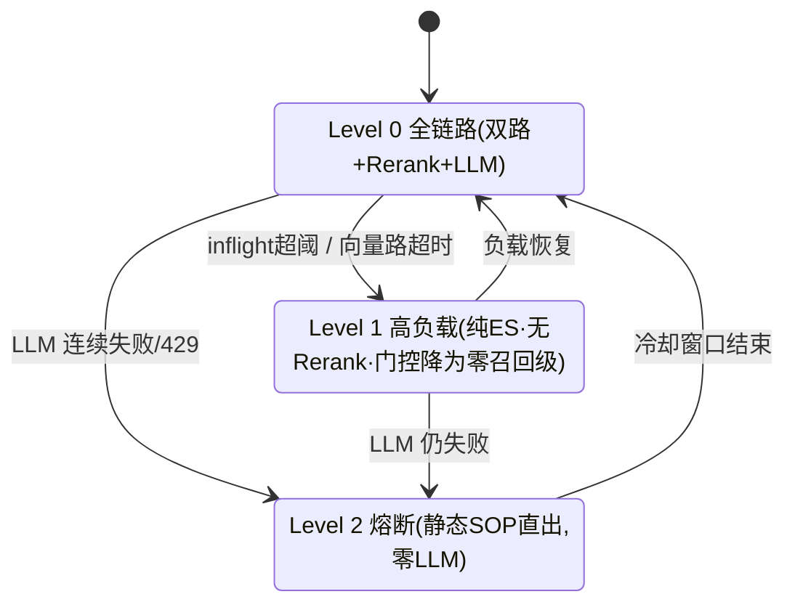

# OpsPilot — AIOps 智能排障与契约检索网关

> 基于 **Java 21 虚拟线程** 的混合 RAG（Hybrid Retrieval）排障网关：ES 倒排 + Qdrant 向量双路召回、RRF 融合、多级缓存、告警风暴指纹收敛与三级自适应降级。

## 它为什么存在（STAR）

- **S**：微服务告警风暴瞬时数千条同质告警打垮 LLM 链路；通用向量检索丢失错误码等精确符号，Top-1 不足 60%。
- **T**：7 天交付高并发混合检索排障网关：精确符号 Top-1 100%、热点 TP99<50ms、500 并发 LLM 降为 1 次、权限泄漏绝对 0；随后追加生产化硬化（租户隔离、账号体系、中间件加固、零空窗重建）。
- **A**（按数据流自下而上六件事，外加过程）：
  1. **切分**——Python AST 切分保护代码块/表格不腰斩，面包屑入元数据；
  2. **双路召回**——ES keyword + Qdrant 向量并行（虚拟线程 + 超时隔离），自研 RRF k=60 无量纲融合；
  3. **压 TTFT**——精确符号快路径命中即跳过 Rerank；
  4. **风暴收敛**——Redisson `来源×指纹` 聚合计数窗口 + 进程内 Single-Flight（窗口供计数叙事，穿透闸门归 Single-Flight）；
  5. **弹性**——三级降级状态机，LLM 429 熔断直出静态 SOP；
  6. **权限**——`auth_level` + `tenant` 双维在引擎层硬过滤，缓存与回放全链路携带权限维度。
  - *过程*：五轮 QA 红队 + 双轴 code-review 闭环（P0 提权绕过 / TDD 锁；第四轮三 Persona 全系统测评揪出 Single-Flight 缺租户与 admin 信任域两处 P0；第五轮生成质量包立逐字导出出口硬护栏与熔断半开自愈）→ v1.0.0 冻结 → DashScope live 实测 → 四 Sprint 生产化（H2 账号+实时吊销、中间件凭据+环回、blue/green 原子切流、审计/配额/CI）→ 转公开前全模块独立+集成复验（台账 `docs/qa/2026-09-13-module-verification.md`），债务带触发线记录在案。
- **R**：精确 Top-1 100%、语义 Hit@3 100%（hybrid 较纯 ES 把语义 Top-1 从 64% 拉到 88%）、热点命中 TP99 16ms（服务端 TTFT，产物 `offline/load/reports/l1_hit_latency.md`）、500 并发 LLM 仅 1 次、越狱与跨租户零泄漏（双向判别语料 + 跨租户并发用例锁死）、场景 A 0 失败——均以 DashScope live 实测；生产化改造后 live 评测**逐位一致（零质量回退）**，蓝绿在线切流实测零中断（切流期间 27 个在线探针 0 失败、全程约 40s；复测 423 chunks 22.3s）。**上表与本节的具体数字另见下方「核心指标」**。

## 核心指标（实测）

| 维度 | 目标 | 实测 | 口径 |
| --- | --- | --- | --- |
| 精确符号 Top-1 命中率 | 100% | **100%** | hybrid，34 错误码用例（live） |
| 语义 Top-3 召回率 | >90% | **100%** | hybrid，25 口语化用例（live） |
| 热点命中 TP99 | <50ms | **16ms** | L1 回放 n=200 的**服务端 TTFT**（回放不触外部 API）；端到端 p99=46.3ms 含本机 HTTP 栈开销——产物 [offline/load/reports/l1_hit_latency.md](offline/load/reports/l1_hit_latency.md) |
| 风暴 LLM 触发次数 | 500→1 | **1** | 500 并发同指纹，llm_calls Δ=1（live） |
| 权限泄漏率 | 0 | **0** | 5 条越狱用例，引擎层过滤（live） |
| 场景 A 吞吐 | — | **88.4 req/s · 2492 请求 0 失败 · P50=16ms** | Locust 50 并发 30s（live，冷请求走真实 API；与随附 `locust_a_stats.csv` 一致） |

> **读表前先看三条口径**：① 以上均为 **DashScope live** 后端实测——`text-embedding-v3`（1024 维神经语义）+ `gte-rerank-v2`（精排）+ `qwen-plus`（流式生成）；无 key 时自动切本地词法 mock 后端（同代码路径，双模自动切换），**mock 下不承诺这些数字**。② 「场景 A 吞吐」与「风暴」**不是同一种负载**：前者是混合查询（80% 热 + 20% 冷），后者是**同指纹风暴**（全量去重、请求极快）。③ 这两行来自 **2026-09-09** 的运行，早于 P2 账号体系；后来的 `concurrency_sweep` 曲线（拐点在 200→300 并发，且降级状态机在实测中未触发，见「三级自适应降级状态机」节）测的是另一件事——**三者的数字不可互相推广**。
>
> **live 独有的论证价值**：评测集显示语义查询的 **Top-1 命中率 `es_only` 仅 64% → hybrid 88%**（语义 MRR 0.767→0.940；语料扩至 303 篇前为 72%→88%）——向量路把纯词法在首位漏掉的 24 个百分点口语化查询捞了回来。这是 mock 词法后端无法暴露、也只有接入神经向量后才成立的混合检索核心卖点。**扩语料会让纯词法腿漂移**：语料 303→423 chunks 后 `es_only` 语义 Hit@3 由 100% 降至 92%、MRR 0.813→0.767，而 hybrid 逐位不变——混合检索的稳健性正体现在这里（E1 教训第二次实测复现）。报告出处与生成时刻见 `offline/eval/reports/PROVENANCE.json`（内容摘要判据，CI 强制同代）。

## AIOps 谱系定位 · 是什么，以及明确不是什么

> 回应一个专业读者必然会问的问题：**这算 AIOps，还是只是一个 RAG？** 按 Gartner 谱系五域自证，状态三分类——**已覆盖 / 待还债（触发线在案）/ 永久非目标（产品承诺）**，每条带可核验指针。此表同时渲染在 Ops Console 面板（能力边界旁），"知道自己不是什么"也是一等可观测面。

| AIOps 能力域 | 状态 | 事实与边界 | 证据指针 |
| --- | --- | --- | --- |
| ① 遥测采集（metrics/traces/topology） | **永久非目标** | 输入恒为一段文本 query（人贴堆栈或告警系统 POST），无指标流/事件总线/拓扑图；做成采集平台是另一个产品，不是本系统的缺口 | 「架构」节图入口面（三入口皆文本协议）；`gateway/CopilotController.java`、`gateway/OpenAiController.java`（全部入参=文本+元数据） |
| ② 异常检测（统计/ML） | **永久非目标** | 全仓无检测算法路径——"何时算异常"的判定权恒归上游告警系统，本系统消费其结果 | `grep -riE "anomal|forecast" src/main` 为空；CONTEXT.md 术语表无此词条（有词条必先入术语表，反向可验） |
| ③ 告警降噪 / 事件收敛 | **已覆盖（同指纹域）**，边界明示 | `来源×指纹` 滑窗计数 + 进程内 Single-Flight：500 并发同指纹 → LLM 仅 1 次。**跨指纹 incident 关联未覆盖**——但 2026-09-16 起**前置已满足**（自举告警源提供了真实告警流，[ADR-0011](docs/adr/0011-self-bootstrapped-alert-source.md)），该边界已入债务账并带触发线（OPS §5），不再"未在账" | `storm/FingerprintService.java`、`storm/SingleFlightRegistry.java`；[ADR-0003](docs/adr/0003-single-instance-inprocess-single-flight.md)；A2-5（`offline/acceptance_a2.py`）；台账 `docs/qa/2026-09-16-self-alert-loop.md` §2.1（11 条同故障告警 → 指纹一致、LLM 增量 0） |
| ④ 知识化根因辅助 | **已覆盖（检索域）**，边界明示 | 双路召回 + RRF + 精排 over 63 篇复盘/Runbook + OpenAPI；置信度不足显式拒答而非硬编。**边界：知识库是只读的**——运行期没有任何「结论→语料」回灌路径，语料由人工撰写、重建靠 `POST /admin/reingest` 从既有 `chunks.jsonl` 重灌；"真实排障结论沉淀回知识库"这一环**未覆盖**，已按触发线登记（OPS §5.1） | `retrieval/HybridSearchService.java`；[ADR-0001](docs/adr/0001-java-online-python-offline-split-at-jsonl.md)/[ADR-0002](docs/adr/0002-dashscope-one-stop-1024-dim.md)；`offline/eval/reports/eval_report.md`（es_only 64%→hybrid 88%，现报告版）；`ingest/IngestionRunner.java`（只读 chunks → 写派生索引） |
| ⑤ 处置闭环（动作执行/自愈） | **待还债（触发线在案）** | 当前形态=输出可溯源排障步骤供**人**执行；对目标系统零写操作是产品承诺非缺陷。触发线（合取）：接入可审计执行通道（runbook 执行引擎 + 审批链/HITL 门）后立项。**告警接入侧已解除挂起**——自举告警源已上线（ADR-0011，换源而非 adapter）；面向外部监控系统的 adapter 仍按硬约束挂起 | OPS §5 债务闹钟表"处置闭环"行（含 2026-09-16 状态注）；`docs/ops/production-readiness-2026-09-12.md` M3 |

**一句话口径**：OpsPilot 做的是 AIOps 的 **③④ 两个子域的网关入口层**——"让告警风暴里的一条 query 得到可信、可溯源、越不了权的排障建议"。标题词 AIOps 指的是这个可验证子集；①②⑤ 上表三分类各归其位，欢迎按证据列逐行核验。

## 与朴素 RAG 的五条差异

> 骨架诚实承认：检索+生成就是 RAG。差异在骨架外那一圈**决定运维工程师敢不敢信**的东西——每条 = 机制 + 代码 + 验收锁，不是形容词：

1. **不知道就说不该知道**：检索 Top-1 相关度低于阈值或零召回 → 显式拒答并**跳过 LLM 调用**（朴素 RAG 会把空上下文硬喂给模型赌它不编）；精确符号快路径天然高置信豁免门控。→ `gateway/ChatOrchestrator.java` 门控分支、`config/OpsPilotProperties.java`（min-relevance）、QA 台账 P2-6（慢拒答归因）。
2. **权限是数据层不变量，不是提示词约定**：tenant/auth_level 以 term/range 注入 ES Query DSL 与 Qdrant Filter 双引擎，Prompt 越狱语料实测零泄漏——防线里没有任何"请不要回答越权内容"式的软承诺。→ `retrieval/EsSearchService.java`、`retrieval/QdrantSearchService.java`、[ADR-0008](docs/adr/0008-permission-dimensions-on-every-shared-path.md)、A2-8/8b/8c 边界矩阵。
3. **"可读"不等于"可倒出"**：出口句级 LCS 硬护栏（连续重叠 >80 字整句替换占位，carry=160 堵"逐行不超阈、拼接超阈"的表格式漏检），且设卡一处即同时覆盖生成流、缓存回放、Single-Flight follower 与双协议面。→ `llm/VerbatimStreamFilter.java`、`llm/VerbatimGuard.java`、[ADR-0010](docs/adr/0010-generation-layer-enforcement-split.md)、探针 V2/V3（`offline/qa_gen_quality_probes.py`）。
4. **溯源是合同不是装饰**：答案 refs 进 L1/L2 缓存 payload、随 Single-Flight 回放、落 SSE done 帧——引用标号在缓存命中路径与现网生成路径逐字节一致（第四轮 QA 曾把"L2 命中丢 refs"按缺陷修复并入回归锁）。→ `cache/L2SemanticCacheService.java`、A2-3/A2-9 引用断言。
5. **风暴与故障是设计输入，不是运行时异常**：同指纹 500 并发→1 次 LLM 穿透；过载降纯 ES、LLM 熔断直出预热静态 SOP、冷却到期半开自探（修复见 `e966feb`）——降级是状态机的一等公民，不是 catch 块。→ `storm/SingleFlightRegistry.java`、`resilience/DegradationStateMachine.java`、A2-5/A2-6、`DegradationRecoveryTest`。

> 五条合起来是一次**成功标准的换位**：朴素 RAG 的成败判据在检索指标；本系统的判据在"每个出口都可信"。这也解释了测试面为何比检索评测宽得多——152 单测（`@Test` 声明数）+ A2 十项 + 生成质量门禁 V1–V9（其中 live 六道 V2/V3/V4/V5/V7/V9 由 `offline/qa_gen_quality_probes.py` 承担，V1=Java 单测、V6=ZSET 混源用例、V8=文档核对；V9=答案接地一致性，复用 V2/V4 已产出答案故不占 chat 预算）+ 越狱/风暴/降级/留痕矩阵。

## 架构（30 秒看懂数据流）

三个入口共享同一条编排链路——这正是"两个协议面 + 一个面板"能保持语义一致的原因：

```mermaid
flowchart TD
    subgraph ENTRY[三个入口 · 同一编排]
        SSE[Console 客户端<br/>POST /api/v1/copilot/chat/stream · SSE]
        OAI[任意 OpenAI 客户端<br/>POST /v1/chat/completions · chunk]
        PANEL[Ops Console 面板<br/>只读 · /admin/state + audit 流]
    end
    SSE -->|JWT| AUTH
    OAI -->|JWT 即 API Key| AUTH
    AUTH[JwtAuthFilter · DB 单真相<br/>每请求查 H2：存在性/禁用/token_ver 吊销<br/>注入 tenant × auth_level × role]
    PANEL -->|platform 门禁 role=platform| ADM[AdminController<br/>聚合快照 + 审计事件环]
    AUTH --> OC[ChatOrchestrator · 唯一编排]
    OC --> QT[配额 5000/天/sub]
    QT --> FP[指纹归一化 SHA-256<br/>掩时间戳/UUID · 保留错误码]
    FP --> SF{Single-Flight<br/>组键 tenant+fp+authLevel<br/>ADR-0008 权限三元组}
    SF -->|follower| RP[回放 leader 答案<br/>载荷 src_tenant 绊线 fail-closed]
    SF -->|leader| HY[混合检索 双路并行 虚拟线程+超时隔离]
    HY --> ES[ES keyword Top-50<br/>tenant term + level range 硬过滤]
    HY --> QD[Qdrant 向量 Top-50<br/>must tenant + level lte]
    ES --> RR[RRF k=60 无量纲融合]
    QD --> RR
    RR --> RK[Rerank gte-rerank-v2<br/>精确符号快路径跳过]
    RK --> GT{置信度门控<br/>Top-1 < 0.2 或零召回}
    GT -->|拒答| NO[显式拒答 · 跳过 LLM]
    GT -->|通过| LLM[qwen-plus 流式生成]
    LLM --> WB[写回 L1/L2 缓存<br/>key/payload 全带租户]
    DG[三级降级状态机<br/>L0/L1/L2 见下图] -.->|L1 纯 ES / L2 熔断 SOP 直出| HY
    DG -.-> LLM
    RP --> OUT[Sink 投递：SSE meta/delta/done<br/>或 OpenAI chunk+[DONE]]
    NO --> OUT
    WB --> OUT
    OUT --> AUD[审计 logs/audit.jsonl<br/>谁/何租户/何密级/命中来源<br/>拒绝路径同样留痕]
```

- **权限是引擎层硬过滤不是 Prompt 约束**：tenant 与 auth_level 以 term/range 注入 ES Query DSL 与 Qdrant Filter，越权话术无法跨越数据级过滤；role 只在平台管理面生效（ADR-0008：权限三元组必须同构存在于每一条共享路径）。
- **知识库零空窗重建**：`POST /admin/reingest` 走 blue/green 别名原子切流（ADR-0006），失败保留旧库在线，实测 423 chunks 22.3s 零中断（live，服务端日志口径；mock 后端 8.0s）。

### 三级自适应降级状态机


```mermaid
stateDiagram-v2
    [*] --> L0
    L0: Level 0 全链路(双路+Rerank+LLM)
    L1: Level 1 高负载(纯ES·无Rerank·门控降为零召回级)
    L2: Level 2 熔断(静态SOP直出,零LLM)
    L0 --> L1: inflight超阈 / 向量路超时
    L1 --> L0: 负载恢复
    L0 --> L2: LLM 连续失败/429
    L2 --> L0: 冷却窗口结束
    L1 --> L2: LLM 仍失败
```

**降级的代价（如实登记，不只讲好处）**：L1 的检索质量就是 `es_only` 模式的质量——语义 Hit@1 由 88% 退到 64%；更值得说清的是第二项代价：摘除 Rerank 后没有可依的相关性分数，**置信度门控在 L1 退为「零召回级」**，即"不知道就不答"这条主张在降级期是弱化的（不是消失：零召回仍拒答）。取舍理由与重开触发线见 [ADR-0012](docs/adr/0012-degradation-cost-semantics.md)。

**降级机制在实测负载下的可见范围（2026-09-25 六档压测，如实登记）**：`offline/load/reports/concurrency_sweep.md` 扫 25→500 并发（混合负载，live），结果是——**各档在途峰值最高只有 11，远低于 L1 触发线 40，故降级状态机全程未触发**；而 u≥200 出现的失败**全部**是连接层失败（`HTTP 0`，无一条 5xx）。即：这一栈上连接层先在 200→300 之间给出上限，压力从未传到应用的在途计数。**所以"过载时降级而非拒绝"这条主张，在本机实测范围内没有被行使过**——不是它失效，是本机栈先以另一种方式失败了。连接层失效的具体成因未隔离（候选：本机 Windows 回环 / TIME_WAIT 端口耗尽、Tomcat accept 队列），需 Linux 运行或调高连接上限后复测。**引用口径提醒**：上表「500 并发同指纹 → LLM 仅 1 次」是**风暴场景**（全量去重、请求极快）的数，与这条曲线测的**不是一回事**，不可互相推广。

## 技术栈

| 分层 | 选型 |
| --- | --- |
| 网关 | Java 21 + Spring Boot 3.3（Virtual Threads + SseEmitter） |
| 并发 | CompletableFuture + 虚拟线程执行器（双路并行、超时隔离） |
| 缓存/防线 | Redisson + Redis 7（滑动窗口计数、L1 精确缓存、SOP 预热、配额 INCR） |
| 风暴收敛 | 进程内 Single-Flight（JDK `ConcurrentHashMap`+`CompletableFuture`，无外部依赖；ADR-0003） |
| 检索 | Elasticsearch 8（keyword 倒排）+ Qdrant（gRPC 向量） |
| 融合 | 自研 RRF（k=60）+ DashScope gte-rerank-v2 |
| 推理 | DashScope qwen-plus（OpenAI 兼容 SSE，JDK HttpClient 手写解析） |
| 离线 ETL | Python 3.11（OpenAPI AST 切分 + Markdown 标题树切分） |

## 快速开始（三条命令，零 key 零成本）

```bash
git clone https://github.com/shing26/opspilot-aiops && cd opspilot-aiops
bash scripts/quickstart.sh   # 生成随机凭据 .env（key 留空=mock）→ Docker 全栈（含网关镜像）→ seed 演示账号
bash scripts/demo.sh         # 预检全 PASS = 机制全链路就绪；打开 http://localhost:8081/ 即 Ops Console 面板
```

可选·机制级验收（对活体栈实跑，非单测）：`(set -a && . ./.env && set +a && cd offline && python3 acceptance_a2.py)`（10 项：L1/L2 缓存、500 并发风暴收敛、跨租户矩阵、拒绝留痕）与 `acceptance_a3.py`（8 项综合）。

> **口径必读**：`DASHSCOPE_API_KEY` 留空时服务自动切换 **mock 词法后端**（同一代码路径，零外部调用、零 Token 成本）——三条命令复现的是**机制正确性**；本页「核心指标」表为 **DashScope live 实测**口径，需自备 key 填入 `.env` 后重跑 `quickstart.sh` 复现，mock 环境不承诺该表数字。

前置：Docker（含 compose v2 + buildx 插件，quickstart 会预检并给出安装指引；即 `docker compose`/`docker buildx` 两条命令可用）、Linux/macOS 或 Windows+Git Bash；python3 可选（红队 token 生成与可选验收脚本用，缺失时 quickstart 会提示跳过）。内存预算：全栈 ≤2.4GB。

<details>
<summary><b>开发者路径</b>（宿主裸进程跑网关，需 JDK21 + Maven；与容器模式二选一，都占 8081）</summary>

```bash
# 1. 环境变量（凭据只从环境读取，.env 不入库）
cp .env.example .env   # DASHSCOPE_API_KEY（留空走 mock）、JWT_SECRET、DEMO_PASSWORD、H2_DB_PASSWORD

# 2. 中间件
docker compose up -d   # Redis + Qdrant + ES（总内存 ≤2GB）

# 3. 离线切分 → chunks.jsonl（Windows venv 为 Scripts/，Linux/macOS 为 bin/）
cd offline && python3 -m venv .venv && .venv/bin/pip install pytest
.venv/bin/python chunkers/build_chunks.py
.venv/bin/python -m pytest tests/

# 4. 红队畸形 token（验收用；合法账号不预签 token，走 login）
python ../scripts/gen_tokens.py > ../scripts/redteam_tokens.txt

# 5. 构建 + 启动（首启若读别名缺失会自动入库）
mvn package -DskipTests && java -jar target/opspilot-gateway-1.0.0.jar

# 6. 初始化演示账号（幂等，读取 DEMO_PASSWORD）：sre-limited/sre-full/sre-acme/sre-watcher
bash scripts/seed_demo_users.sh

# 7. 演示（客户端自动 login 换 24h token）
.venv/bin/python console_client.py "下单报 50012_DB_TIMEOUT 怎么排查"
.venv/bin/python console_client.py --storm --storm-n 500   # 告警风暴
```

</details>

## Ops Console 运维面板（只读可观测面）

浏览器开 **`http://localhost:8081/`** 即得（同源静态单页，零构建/零 CDN/离线可开；ADR-0009）。把已存在的 metrics/health/audit 真相渲染成五块——**运行状态**（build 指纹 + 三依赖灯 + live/mock）、**降级状态机**（L0/L1/L2 交通灯 + 熔断计数与冷却倒计时 + MANUAL LOCK 徽标）、**数据流**（真计数墙 + Single-Flight 在途组 + 审计事件游标流）、**能力边界**（每条"不做的事"带依据与最后验证日期）、**AIOps 谱系定位**（本文档上方五域表的静态同源版，状态三分类+证据指针，把"不是完整 AIOps 平台"写在展示面上）。接入需 role=platform 的 JWT（=login token，即密钥），取法见 OPS §9。

设计口径与 LobeChat 撤壳（ADR-0007）互为注脚：**UI 壳证明兼容性，面板承载运维真相**——本页零写操作、零模拟动画（速率=前端对真实累计值求差）、成功读路径不落审计（实测轮询 60s audit 行增量 0）；事件游标用全局 seq 且轮转/重启以 `truncated` 显式告警，禁静默空洞。键名契约由 `scripts/check_panel_contract.sh` 在 CI 双向钉死（后端改名不同步面板即红）。演示用法见 DEMO 幕④⑥口播。

## OpenAI 兼容面（/v1）

网关自带 OpenAI 规范端点，任何标准客户端（LobeChat / Dify / OpenAI SDK）可直连：

```bash
# 身份即密钥：API Key = 用户自己 login 换来的 24h JWT（租户/密级/吊销/配额/审计全穿透）
set -a && . ./.env && set +a   # 口令只从 .env 的 DEMO_PASSWORD 来
TOKEN=$(curl -s -X POST http://localhost:8081/api/v1/auth/login \
  -H 'Content-Type: application/json' -d "{\"username\":\"sre-full\",\"password\":\"$DEMO_PASSWORD\"}" \
  | sed -E 's/.*"token":"([^"]+)".*/\1/')

curl -N http://localhost:8081/v1/chat/completions -H "Authorization: Bearer $TOKEN" \
  -H 'Content-Type: application/json' \
  -d '{"model":"opspilot","stream":true,"messages":[{"role":"user","content":"how to fix 50012_DB_TIMEOUT"}]}'
# → role 首帧 → content 增量帧 → 「## 参考来源」溯源注入 → finish_reason=stop → data:[DONE]
```

**接入方式**：上面 curl 即最小可用闭环；任何 OpenAI 标准客户端（LobeChat / Dify / SDK）填 Base URL `http://localhost:8081/v1` + API Key=上面的 TOKEN 即可直连。本仓库不捆绑 UI 前端——2026-09-11 曾以 LobeChat 壳实测全链路穿透（见 ADR-0007 状态注），后评估聊天壳对"运维系统可视化"零增益而撤除；协议面保留为展品本体，演示主形态为 curl 直播（DEMO 幕⑦）。

**协议取舍声明**（详见 ADR-0007）：无状态单轮——取最后一条 user 消息，忽略 system/历史（检索按单 query 指纹设计，多轮请由客户端并入单条消息）；自定义 meta/ttft 在 OpenAI 帧无位置，丢弃；溯源以正文尾部 markdown 保留。注意 Windows Git Bash 的 `curl -d` 发中文有 GBK locale 坑，测试请含 ASCII 或用脚本。

## 自举告警源（dogfooding）

语料、query、评测集、压测流量全部由本项目自己生成——"在合成场景上正确"从未被真实输入检验过。自举告警源补上这一环：**把项目自己的运行史当作告警源**（[ADR-0011](docs/adr/0011-self-bootstrapped-alert-source.md)）。

```bash
cd offline && PY=.venv/Scripts/python.exe   # Windows；Linux/macOS 为 .venv/bin/python
set -a; . ../.env; set +a                   # 口令与密钥只从环境读取
$PY alert_producer.py --once                # 单轮探测（验收友好）
$PY alert_producer.py                       # 常驻，默认 15s 一轮
$PY alert_producer.py --dry-run --once      # 只判定与留痕，不发任何请求
```

五条规则，取数全部来自既有**只读**面 `/api/v1/admin/state`（不新增后端接口、不新增指标）：

| 规则 | 判据 |
| --- | --- |
| 依赖 DOWN | `health.{redis,qdrant,es}.status != UP`（告警文案带组件真实 detail） |
| 熔断 / 降级 | `runtime.degradation.level ∈ {L1,L2}` 或 `cooldown_s > 0` |
| 上游限流 | `metrics.llm_rate_limited` / `llm_network_errors` 增量 > 0 |
| 检索路劣化 | `retrieval_timeouts` 增量 > 0 且伴 `es_only_requests` 增量 |
| 拒答 / 降级直出 | `low_confidence_refusals` / `sop_fallbacks` 增量 > 0 |

命中即 `source=alert` POST 回既有入口，之后走**同一条流水线**（指纹归一 → Single-Flight → 缓存 → 检索 → 生成）——"系统自己发的告警"与人工排障共享全部护栏与溯源。告警主体是独立账号 `sre-watcher`（平台级，配额与审计主体与演示账号隔离），审计行新增 `source` 字段与 `via` 正交，来源可辨。护栏：**单实例锁**（多实例会成倍告警；僵死锁 120s 可接管）、每规则冷却 300s、每小时上限 20 条、**本主体**配额保留线 50、登录失败指数退避且连续 3 次即退出（凭据错不该把 15 分钟锁定刷成常锁）、计数器复位识别、单轮失败不退出、出口走 localhost 白名单（解析后 IP 仍须为环回、不跟随越界重定向）。

> **已知盲区（不假装覆盖）**：网关自身不可用时，生产者经 `/state` 无法自证，只能记 `unreachable`——单进程自举的固有边界。实测证据、未收敛项与两次真实故障自检记录见 [docs/qa/2026-09-16-self-alert-loop.md](docs/qa/2026-09-16-self-alert-loop.md)。

## 评测与压测

```bash
cd offline
PY=.venv/bin/python          # Windows venv 为 .venv/Scripts/python.exe；或直接 bash ../scripts/py.sh 探测
$PY eval/build_golden.py     # 59 样本（34 精确码 + 25 语义）
$PY eval/evaluate.py         # 3 模式对比 + 越狱 → eval/reports/（报告自报服务端 live/mock 后端真相）
$PY eval/gate_matrix.py      # 门控误拒/漏拒率 + 阈值扫描 → eval/reports/gate_matrix.md
$PY eval/observed_probe.py   # 真实输入探测（无真值口径）→ eval/reports/observed_probe.md
$PY load/sweep.py            # 并发-延迟曲线（六档）→ load/reports/concurrency_sweep.md
$PY load/cache_savings.py    # 缓存节省账 → load/reports/cache_savings.md
.venv/bin/locust -f load/locustfile.py --headless -u 50 -t 30s --html load/reports/locust_a.html
SCENARIO=storm .venv/bin/locust -f load/locustfile.py --headless -u 500 -t 20s --html load/reports/locust_b.html
$PY load/l1_latency.py       # L1 回放延迟（热点命中口径）→ load/reports/l1_hit_latency.md
```

> 需活体栈 + `pip install -r offline/requirements-dev.txt`（锁定的 pytest/locust 版本，见该文件）；`evaluate` 依赖的 `/copilot/search` 不受配额限制。数字底稿与指标出处即 `offline/eval/reports/eval_report.md` 与 `offline/load/reports/`。

**数字怎么核对**（本项目的卖点之一，所以放在这里）：`python provenance.py --check` 判"随附报告是否仍是当前语料的报告"，判据是**内容摘要**而不是 mtime——CI 的 `git checkout` 会把所有 mtime 刷成检出时刻，时间戳判据在那里恒真、等于空门闩。语料字节变了而报告没重生成，摘要必然对不上，CI 的 `provenance` job 即转红；`evaluate.py` 每次运行自动刷新出处登记 `eval/reports/PROVENANCE.json`，人不需要记得同步。`python scripts/pack_evidence.py` 则一键产出**逐项注明出处**的证据快照（入口 `MANIFEST.md` 写明每个数字来自哪个文件、什么命令产生、在当前模式下能否复核）。机制的完整说明与绕过方式见 [OPS.md](OPS.md) §5——README 不复述运维细节。

> **本节的六个测量脚本，口径与已知边界都写在各自的产物里**（例：`gate_matrix` 走 `/search` 故不含 L1/L2 缓存、`cache_savings` 的未命中组必须是**真生成**而非拒答）。**引用前先读产物里的口径段**，那是它们的单一事实源。

## 安全设计

- **凭据零入库**：`DASHSCOPE_API_KEY`/`JWT_SECRET`/`DEMO_PASSWORD`/`H2_DB_PASSWORD` 仅从环境变量读取，`.env` 已 gitignore。
- **账号体系（P2）**：H2 文件主库 + bcrypt 口令 + 24h 短时 JWT；吊销实时——每请求校验账号存在性/disabled/token_ver，禁用或轮换版本即时全局失效旧 token（无黑名单膨胀）；登录失败 5 次/15min → 429；用户管理仅 CLI（口令只经 env/stdin，不进 argv），无 HTTP 用户端点。权限维度以 DB 为唯一真相，旧高等级 token 不残留权限。
- **租户隔离（P1）**：`tenant` 与 `auth_level` 同为 ES/Qdrant/L2/SOP 四面的引擎硬过滤维度（term 等值 + range lte 双 must）；tenant claim 缺失/空白/超长在入口 401。**每一条跨请求共享路径同构携带全部权限维度**（ADR-0008）：L1 key 掺租户、L2 payload 带租户、SOP key 分租户、Single-Flight 组键掺租户且回放带 `src_tenant` 绊线——第四轮 QA 曾证实并修复"引擎过滤完备但并发共享旁路漏掺"的 P0 类缺陷（回归锁 `ChatOrchestratorTest` + A2-9 跨租户并发用例 + acme 自有语料双向判别）。
- **权限引擎层硬隔离**：`auth_level <= user_level` 注入 ES Query DSL 与 Qdrant Filter，Prompt 越狱无法跨越数据级过滤（实测 5 用例零泄漏）。检索密级恒等于 token 的 auth_level，**客户端不可通过参数覆盖**（QA 红队发现 `authLevelOverride` 提权面后已移除）。
- **运维端点鉴权**：`/api/v1/admin/**` **全部要求平台管理员**（DB `role=="platform"` ∧ `auth_level>=3`）——密级≠信任域，任何单一租户的高密级用户不得重建共享索引/清全局缓存/读运营指标（第四轮 QA 修正旧"level≥3 即管理员"口径；回归锁 AdminControllerTest 18 格矩阵）。
- **缓存不成为泄漏通道**：L1 Key 掺 authLevel；L2 payload 携带 `max_auth_level` 并在检索时过滤；L2 命中回放携带完整 refs 保证溯源。
- **Single-Flight 按权限分组**：key=**tenant**+fingerprint+authLevel，防低权限等待者复用高权限答案、更防跨租户共享（第四轮 QA 修复：key 曾缺 tenant，告警风暴并发下外来租户可回放内部租户全文——恰好是最引以为傲的场景；回放入口另有 fail-closed 租户绊线）。
- **指纹归一化抗噪**：掩码时间戳/UUID/traceId/msgId/引号串/数字（保留错误码身份），使真实告警变体（每条带唯一 ID）收敛到同一指纹——实测 10 条变体并发 → LLM 仅 1 次。
- **输入校验与错误卫生**：空/null query 在流开始前返回 400 **且错误文案必达客户端**（SSE 端点的 produces 会吞掉常规 advice 响应体——第四轮 QA 修复为直写 JSON）；客户端错误全面分层不落 500——参数类型/方法/媒体类型/未知路径（第五轮）与**请求体反序列化、Accept 协商**（转公开前复验补口，OpenAI SDK 非流式默认头即触发过 500）各有专属分支，400 类同步留 `ev=invalid` 审计，活体攻击参数面矩阵 13 用例 0×5xx；备份路径白名单拒绝呈现 400 可操作文案而非 500；`/v1` 面错误恒保持 OpenAI 标准 error 形状（filter 短路经直写、mapping 期异常由全局处理器按 URI 分流）；全局异常处理器屏蔽 JVM 内部文案。
- **置信度空态门控**：检索 Top-1 相关度（Rerank 分数）低于 `min-relevance`（默认 0.2）或零召回时，显式拒答并**跳过 LLM 调用**（省算力、不误导）；精确符号快路径天然高置信，豁免门控。mock 后端用 IDF 词元覆盖率作相关度信号，live 模式自动切换为 `gte-rerank-v2` 校准分数。
- **SSRF 防护**：离线客户端/脚本仅允许 localhost 白名单（`localapi.py` 单一事实源）。
- **知识库零空窗重建（P4）**：blue/green 别名原子切流——staging 灌库 + 计数硬验收 + 单请求换 ES/Qdrant 别名，失败保留旧库在线（`POST /api/v1/admin/reingest`，ADR-0006）；实测在线把 mock 向量集零中断切到 live。
- **合规审计**：业务请求每请求一行 JSON 落 `logs/audit.jsonl`（谁/何租户/何密级/查了什么/结果最高密级；回放路径另携带 `src_tenant` 命中来源）；鉴权拒绝/登录失败/运维动作同样留痕（`ev=auth|admin|invalid`，原因可辨）——"攻击探测事后不可查"曾是第四轮 QA 立案的 P1，现已补全并接入 A2-10 计数断言。14 天滚动。
- **成本护栏（P4）**：`/chat/stream` 每用户日配额（Redis INCR，默认 5000/天可 env 覆盖）——防失控循环；评测/检索路径不受限。
- **CI（P4）**：五个 job——`mvn test`（零 key 零中间件）+ **覆盖率棘轮**（`scripts/check_coverage.py` 读 JaCoCo 产物按 LINE 比门槛，首次实测 47.83%、门槛 46.0；BRANCH 只报不设闸）、面板↔后端字面量契约、`bash -n` 全脚本语法门禁、chunkers 不变量与**跨语言词法护栏**（Python 正则与 Java `EsSearchService.ERROR_CODE` 逐字符比对，防离线/在线漂移导致快路径静默 miss）、以及**证据同代门闩**的两面（面一 `provenance.py --check` 报告↔语料、面二 `doc_numbers.py --check` 文档数字↔产物）与一次**干净检出下的证据打包 smoke**。棘轮是加步骤不加 job（产物就在 `mvn test` 那个 job 里，另起 job 要重跑构建）。**本机量不到覆盖率**：本仓目录名 `OpsPilot — AIOps` 含长破折号，jacoco 的绝对 destFile 经 cmd.exe 传给 `-javaagent` 会被写坏、代理静默不落盘（对照矩阵：相对路径与 ASCII 绝对路径都写得出，含长破折号的写不出）——本机要量需把目录改成 ASCII 名，CI runner 路径本就是 ASCII 不受影响。
- **哈希升级**：缓存 Key 由任务书原 MD5 升级为 SHA-256（安全扫描建议，语义不变）。
- **命名口径为刻意决策**：缓存存储 JSON 用 Jackson 默认 camelCase（`AnswerPayload`，从不上线），对外 SSE 帧用 snake_case（`SseEvents` 手工构 Map）——两域两制不做统一，理由与成本分析见 `AnswerPayload` Javadoc。

## QA 红队加固记录

首轮验收全绿后经**黑盒红队持续加固**，逐轮回填台账与回归锁。完整缺陷表在 [docs/qa/](docs/qa/)（缺陷与验证的**单一事实源**），本节只留"打穿过什么"：

- **两处 P0 都是红队真实触发，不是纸面推演**：① Single-Flight 组键缺 `tenant`——跨租户并发下 follower 回放 leader 的全文与引用（恰落在风暴场景，窗口最宽）；② admin 门禁"level≥3 即管理员"——外来租户的 L3 可重建共享索引/清全局缓存，**测评中真的被执行了一次**（blue/green 救回无损）。两处都改为数据层单一真相（组键掺租户；平台权查 DB `role`）并配回归锁。
- **一处"备份的谎言"**：容器模式下备份落到未映射层，cron 每日假绿 → 加卷映射 + 宿主侧产物存在性校验。
- **一处"永不自愈"**：熔断冷却到期恒判 L2，而 L2 分支零 LLM，失败计数无归零路径 → 改半开自探，并加守卫防"清零过宽 → 熔断永不触发"的反向陷阱。**这是 live 实测第三次推翻纸面闭环**（前两次见台账）。
- **错误分层收口**：客户端错误错落 500 的家族内变体（body 反序列化、Accept 协商——OpenAI SDK 非流式默认头即触发）补专属分支 → 活体攻击参数面矩阵 13 用例 **0×5xx**。
- **数字陈旧取证（E1）**：评测报告系语料扩充前版本，`es_only` 语义 Top-1 实测 72%→64%（hybrid 逐位不变）→ 重生成报告并对齐口径。教训入台账：**文档数字与随附产物必须同代**，现由 CI 两道门闩强制。
- **正向确认**（红队打穿失败，保留为卖点）：串行越权读写零泄露、20/20 畸形 token 全拒、`alg=none`/篡改/空签名全拒、**持 `JWT_SECRET` 重签 `auth_level=9` 提权仍被 DB 真相压回**、CORS 外部 Origin 零放行、存在性 oracle 话术一致。

过程留痕：五轮测评的原始口径在 [docs/qa/2026-09-11-persona-eval.md](docs/qa/2026-09-11-persona-eval.md)、[docs/qa/2026-09-13-module-verification.md](docs/qa/2026-09-13-module-verification.md)、[docs/qa/2026-09-16-self-alert-loop.md](docs/qa/2026-09-16-self-alert-loop.md)；生成层的"分层设卡"决策与各自上限见 [ADR-0010](docs/adr/0010-generation-layer-enforcement-split.md)。

## 规模与目录

**规模**：152 单测（`@Test` 声明数）· 12 项架构决策（ADR）· 423 chunks（切分产物行数）· 63 篇复盘/Runbook 语料（另加 OpenAPI 文档，共 64 篇）· 评测集 59 样本（34 精确码 + 25 语义）· 14 个运维脚本。CI 五 job：`java` / `panel-contract` / `provenance` / `python` / `shell`。

**四份根文档按读者分工**（互不重复）：判断值不值得看 → 本文；起服务/跑演示 → [DEMO.md](DEMO.md)；日常运维与**债务触发线** → [OPS.md](OPS.md)；领域词汇 → [CONTEXT.md](CONTEXT.md)。

**证据在哪**：实测产物在 [offline/eval/reports/](offline/eval/reports/)（评测报告、门控矩阵、真实输入探测）与 [offline/load/reports/](offline/load/reports/)（压测、L1 回放延迟、并发曲线、缓存节省账）；缺陷与验证的原始记录在 [docs/qa/](docs/qa/)；"已经做完什么、证据在哪"在 [docs/ops/](docs/ops/)；架构决策与否决理由在 [docs/adr/](docs/adr/)。

> **完整目录地图、逐包职责、`scripts/` 一览与「收纳规矩」在 [docs/repo-map.md](docs/repo-map.md)** —— 那些是维护者/接手 Agent 向的内容：访客不需要，但接手的人需要，故单独成文而不是占本文篇幅。

## 许可

[MIT](LICENSE)。选它而不是 Apache-2.0：本仓的表达方式是"证据 + 可复核"，许可只需让人**一眼判得了能不能合法借鉴**；显式专利授权在本项目的能力面（无对外 SDK、无分布式交付物）没有对应场景，多一层条款只是多一层读者成本。

`LICENSE` 刻意**不纳入证据快照**（`scripts/pack_evidence.py` 的 REGISTRY）：快照收录的是"可核验的能力声明"，许可是元数据不是声明，收录它只会改变 `CHECKSUMS.sha256` 的项数而不增加任何可核验信息。
